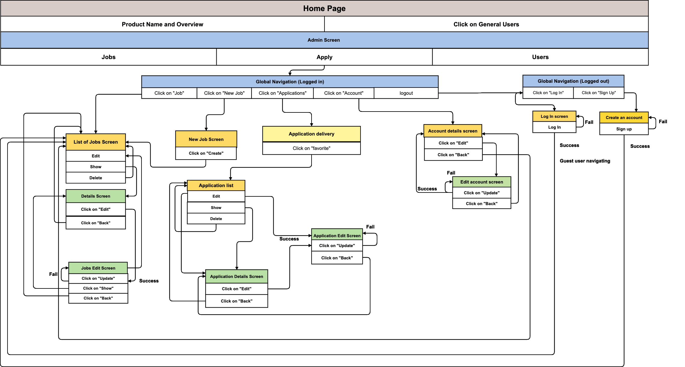

# careerEd

careerEd, a job and education board.

## Requirement Definition

The following steps are needed in order for this application to work.

### Function

```
Create Users
Create Corporate Users
Create Jobs
Job Functions
Login Functions
Application Functions
```

### Development Language

```
Ruby 2.6.5
Rails 5.2.6
```

### Employment Term Technology

```
Devise
Ajax
```

### Technology outside the curriculum

```
stripe - payment
```

### Execution Procedure

#### Enter these commands on the terminal

```
$ git clone https://github.com/NorahNgatjizeko/careerEd
$ cd careerEd
$ bundle install
$ rails db:create && rails db:migrate
$ rails s
```

### Catalogue Design
https://docs.google.com/spreadsheets/d/1Nu81cgInMJ9rVvdwjL41CtXC3LsO9JqfzfERY42Pv9A/edit?usp=sharing

### Table Definition Document
https://docs.google.com/spreadsheets/d/1lgmQphdAIUNGIlU1zXlIfWt18rcvJttQTVz1fG_a_iM/edit?usp=sharing

### Wireframe
https://cacoo.com/diagrams/5UcC1brJzBsUpjTu/E9FD7

### ER Diagram
https://cacoo.com/diagrams/lxJZ5fbKvh6y1JN8/A998A


### Screen Transition Diagram
https://cacoo.com/diagrams/3RgpaspOaru08pvc/854A4

